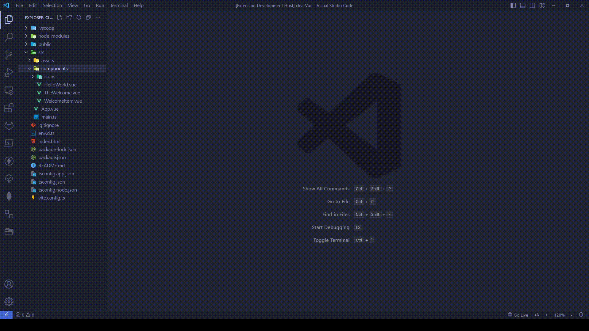

# Vue files generator

Easy way to create .vue files in your project.

## Features

Call the context menu on the folder and select "Vue: create file".

That will open a window where you can adjust the file creation options, like Composition or Option API, typescript, css preprocessor and imports.

You can create one or many files by separating them with a comma.

 

* [Author (github)](https://github.com/pantelav)
* [Repository](https://help.github.com/articles/markdown-basics/)

**Enjoy!**
